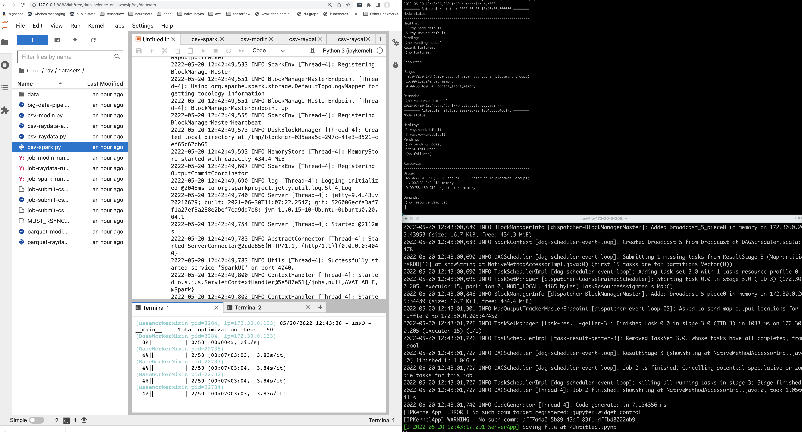

## Setup 
Clone this repo to run the examples on your local laptop:
```
git clone https://github.com/aws-samples/aws-samples-for-ray

cd aws-samples-for-ray/
```

Start your Ray cluster from your local laptop (substitute `cluster-gpu.yaml` everywhere to use GPUs):
```
ray up cluster.yaml
```

## Install JupyterLab and MLflow
Attach to the head node of the Ray cluster
```
ray attach cluster.yaml
```

Install Jupyter Lab on the head node of the Ray cluster:
```
pip install jupyterlab
```

## Run JupyterLab on the head node of the Ray cluster
From your local laptop, Attach to the head node of the Ray cluster
```
ray attach cluster.yaml
```

Run JupyterLab on the head node of the Ray cluster
```
nohup jupyter lab > jupyterlab.out &
```

## Tunnel ports from local laptop to the head node of the Ray cluster
From your local laptop, tunnel port 8888 to the Ray cluster:
```
ray attach cluster.yaml -p 8888
```

From your local laptop, start the dashboard and tunnel port 8265 to the Ray cluster:
```
ray dashboard cluster.yaml # This implicitly tunnels port 8265
```

## Navigate to the JupyterLab and MLflow UIs
From your local laptop, run this command to get the JupyterLab url (and `?token=`) 
```
ray exec cluster.yaml "jupyter server list"
```

Navigate your browser to the URL from above to start using JupyterLab:
```
http://127.0.0.1:8888?token=...
```


